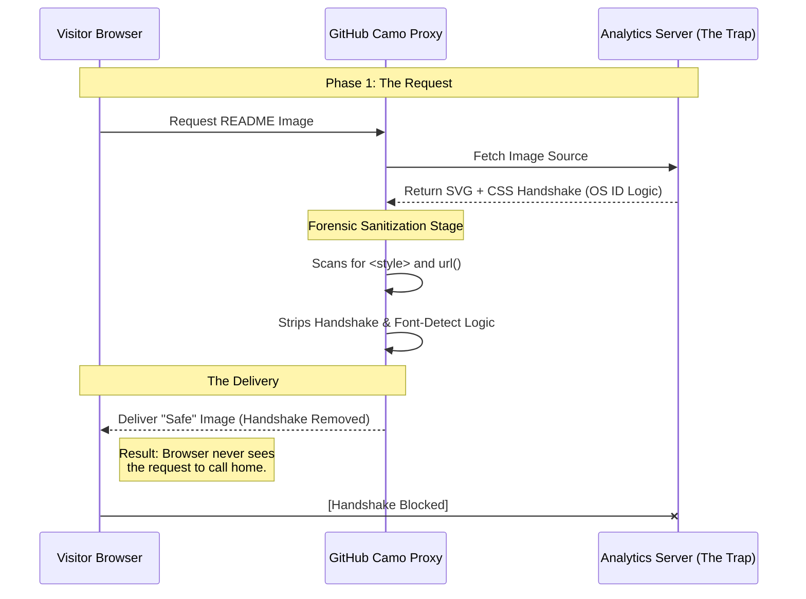

# 🛡️ Github Visitor Counter: The FAILED Handshake

### An Analysis Github profile visitor counters available

> **Professional Note:** This architectural autopsy documents a system conceptualized through the engineering of a human brain and realized through code synthesized by an AI—a collaborative diagnostic of the modern web's security boundaries.

---

## 📖 1. The Core Philosophy: "Guessing" vs. "Proving"

In the world of GitHub profile counters, there is a fundamental divide in how I wanted to count a human:

* **Probabilistic Tracking (The Industry "Guess"):** Used by 99% of counters. They see a request from a Proxy IP and *assume* it’s a human. Because these systems are **Stateless**, every page refresh looks like a "New Unique Visitor."
* **Deterministic Tracking (The "Handshake"):** My goal was to move from guessing to **Architectural Proof**. I aimed to require the visitor's browser to execute logic that only a real rendering engine could perform. No handshake = automated proxy hit = ignored.

The Goal of this Project: To build a system that only counts humans who successfully "handshake" with the server, ignoring all automated proxy crawlers and count unique visitors, returning visitors and bots separately.

---

### 🧠 The Developer's Paradox: A Quest for Sanity

The genesis of this project wasn't a desire for "more data," but a fundamental frustration with bad data.

As developers, we are our own most frequent visitors. While building our profiles, we refresh, we test in Incognito, we check from our phones, and we use work laptops. In any standard visitor counter, this behavior creates a "Statistical Hall of Mirrors" that distorts the reality of our reach:

* **The Ego Inflation:** I would refresh my profile three times to verify a layout change and see the "Unique Visitors" jump by three. I knew I wasn't three people, yet the database—blinded by the lack of session persistence—insisted I was a crowd.

* **The Incognito Trap:** I would open my profile in an Incognito tab to see what a "stranger" sees. Every time, the counter would greet me as a brand-new unique human, unable to recognize the hardware fingerprint beneath the private session.

* **The Proxy Ghost:** I would look at my analytics and see hits from "Seattle, WA" or "Dublin, Ireland"—locations I’ve never visited. These weren't international fans; they were GitHub's internal "Camo" proxy nodes fetching the image.

### The Contrast: Why GitHub is the "Final Boss"

In almost any other context, designing a visitor counter is a trivial task. If you are building a personal portfolio, a SaaS landing page, or a private web application, you have a direct line of sight to the visitor. You can use:

* **Persistent Cookies:** To track a user across weeks of activity.

* **JavaScript:** To capture screen resolution, hardware concurrency, and behavior.

* **Direct IP Access:** To geolocate and deduplicate hits accurately.

On these platforms, there is no "middleman." There is no strict proxy cluster stripping away your headers, re-writing your URLs, or sanitizing your CSS.

**The Paradox:** To build a counter that ignores the developer on GitHub, the developer must first build a counter that can "see" through their own behavior despite being blindfolded by the GitHub Camo proxy.

I became obsessed with the idea of a Zero-Trust Counter. I didn't want the server to trust the IP address (which belongs to GitHub) or the User-Agent (which can be faked). I wanted the server to say: "I don't care who you say you are; until you prove you can render my CSS and resolve my fonts, you don't exist in my database."

---

## 🏗️ 2. System Design: The "Airport Customs" Analogy

I modeled our architecture after a high-security international border. I didn't just want to see the visitor; I wanted to verify their "Passport."

1. **The Passport (ETag Sync):** I hijacked the **HTTP ETag**. It acts as a session-less ID stored in the browser's cache, allowing us to recognize the same visitor without cookies (which GitHub blocks).
2. **The Customs Gate (The SVG):** The visual "Badge" shown on the README.
3. **The Interview (The CSS Font Trap):** This was the "Handshake." Inside the SVG, I hid a CSS `@font-face` request. If a real browser renders the image, it "leaks" a request to our server to download a font. **That leak is the proof of life.**

---

## 📊 3. The Lifecycle of a Failed Handshake

The following diagram illustrates how GitHub's "Camo" Proxy acts as a "Black Box" that strips the logic required for a deterministic handshake.

---

## 🧪 4. Phase-by-Phase Chronology of Failure

This documents the specific engineering attempts to bypass the sandbox and the technical reasons they failed.

### **Phase 1: The OS-ID Handshake (Font Fingerprinting)**

* **The Method:** I used CSS to detect local font availability to identify the visitor's Operating System. By setting a `font-family` that prioritized `Segoe UI` (Windows) or `San Francisco` (macOS) and providing a remote URL fallback for each, the server would "log" which URL was requested.
* **The Result:** **FAILED.** * **Technical Reason:** GitHub Camo identifies external URLs inside CSS as a security leak. It performs a Regex-based sanitization that **strips `<style>` blocks entirely** before serving the image.

### **Phase 2: Successive Partitioned SVGs (The Chain)**

* **The Method:** "Nesting" images. Image A (the gatekeeper) triggers the handshake. Image B (the counter) only updates its count once the database confirms a successful handshake from A.
* **The Result:** **FAILED.** The counter always lagged by exactly one refresh.
* **Technical Reason:** Camo is a **"Flat" Proxy**. It parallelizes all requests. By the time the handshake from Image A reached our server, Image B had already been fetched and cached with stale data.

### **Phase 3: Cache/ETag Persistence Pentesting**

* **The Method:** Forcing `304 Not Modified` responses based on the visitor's ETag to maintain "Identity" across refreshes without using cookies.
* **The Result:** **FAILED.** Identity was lost every 3-5 minutes.
* **Technical Reason:** **Proxy Cluster Decentralization.** GitHub's proxy is a decentralized cluster. A page refresh often hits a different server node than the initial load. These nodes do not share cache context, effectively **"burning" your passport** on every request.

---

## 🔬 5. Technical Appendix: The Camo Sandbox Rules

Through forensic testing, I mapped the "Black Box" of GitHub's security image proxy.

| Rule ID | Targeted Element | Action Taken | Security Logic |
| --- | --- | --- | --- |
| **Rule A** | `<style>` / `<link>` | Strips `url()` | Prevents SSRF (Server-Side Request Forgery) |
| **Rule B** | `href` in `<image>` | Proxy Rewriting | Hides visitor IP and location data |
| **Rule C** | `SMIL` (SVG Animation) | `onbegin` disabled | Prevents XSS-style tracking triggers |
| **Rule D** | `ForeignObject` | Content Stripping | Prevents embedding of arbitrary HTML/JS |

---

## 📉 6. The Verdict: Why GitHub Traffic Tracking is Inaccurate

This repo proves that 100% accuracy behind a modern security proxy is a myth because I tried to compare raw server logs against the native GitHub Insights > Traffic tab:
* **Repo-Specific Isolation:** Traffic is siloed by repository. If a user visits three of your repos, GitHub struggles to link them as a single unique visitor to your profile, causing massive double-counting.
* **Bot Pollution:** High-fidelity CI/CD bots mimic browser headers perfectly and are logged as "Unique Humans" by almost every counter.
* **Privacy Hardening:** Modern browsers and privacy extensions block the headers required to distinguish between different users, making even the most advanced "AI-engineered" logic fall back to probability.
* **Owner Noise:** This repository serves as a showcase of the lengths one must go to to prove a visit—and why the proxy always wins. **Accept the noise.**

* Existing GitHub visitor counters that claim "Accuracy" are statistically flawed. Because they cannot perform a deterministic handshake, every page refresh is treated as a new request. They don't count "Unique Humans"; they count "Successful Proxy Hits."

This project stands as a technical documentation of the current state of web privacy. The "Invisible Handshake" is dead.

---
